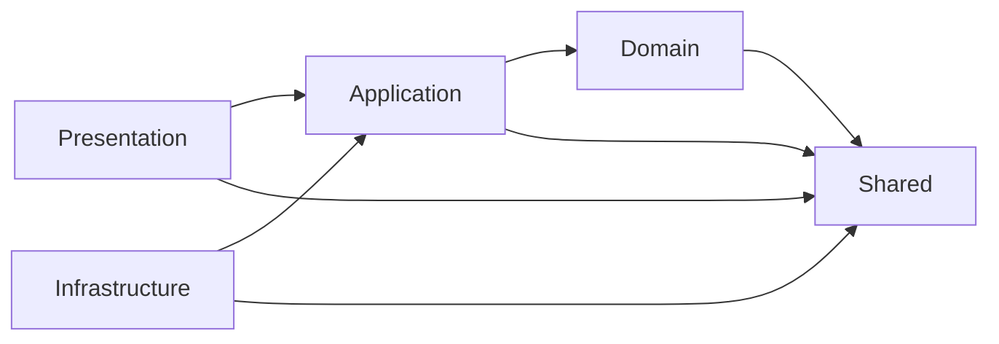

# AGENTS.md — globální instrukce repozitáře

Tento soubor je vstupní bod pro každého AI agenta pracujícího v tomto repozitáři.
Platí pro celý strom. Konkrétnější instrukce v podřízených složkách mají přednost.

## Řetěz dědičnosti instrukcí

Před prací v konkrétní vrstvě si přečti všechny úrovně v tomto pořadí:

1. `AGENTS.md` (tento soubor) — globální pravidla repozitáře.
2. `src/AGENTS.md` — pravidla společná všem vrstvám.
3. `src/<vrstva>/AGENTS.md` — guardrails konkrétní vrstvy.
4. `src/<vrstva>/README.md` — co vrstva dělá a jak ji spustit.

Cursor vnořené `AGENTS.md` slévá automaticky (konkrétnější vyhrává). Každá vrstva
navíc na rodiče explicitně odkazuje, aby byl kontext čitelný i pro nástroje,
které slévání neprovádějí.

## Mapa repozitáře

```text
AGENTS.md              # tento soubor
src/
  AGENTS.md            # společná pravidla vrstev
  <vrstva>/            # domain, application, infrastructure, presentation, shared
    AGENTS.md          # guardrails vrstvy
    .cursor/           # ZDROJ PRAVDY pro agentní konfiguraci vrstvy
    .github/           # lokální composite actions + definice pipeline vrstvy
    src/               # produkční kód vrstvy
    tests/             # testy vrstvy (unit, integration)
    docs/              # dokumentace vrstvy + ADR
.cursor/               # AKTIVNÍ konfigurace pro celý repozitář
  rules/generated/     # GENEROVÁNO ze src/<vrstva>/.cursor — needitovat
  agents/              # globální + generovaní subagenti
  skills/              # globální + generované skills
  hooks.json           # hooky (pouze root)
.github/workflows/     # CI (pouze root)
scripts/               # sync-agent-config.ps1, new-layer.ps1, test-layer.ps1
docs/                  # projektová dokumentace
```

## Architektonická pravidla

Závislosti mezi vrstvami smějí směřovat pouze dovnitř:



- `domain` nesmí importovat žádnou jinou vrstvu kromě `shared`.
- `application` nesmí sahat přímo na databázi, HTTP ani filesystem — jde přes porty.
- `infrastructure` implementuje porty a vlastní veškerý přístup k vnějšímu světu.
- `presentation` obsahuje pouze validaci vstupu a mapování, ne business logiku.
- `shared` nesmí záviset na žádné jiné vrstvě.

## Agentní konfigurace

- **Zdroj pravdy** je vždy `src/<vrstva>/.cursor/`. Nikdy needituj
  `.cursor/rules/generated/**` — je přepsán při každém syncu.
- Po jakékoli změně v `src/<vrstva>/.cursor/` spusť:

  ```powershell
  pwsh -File scripts/sync-agent-config.ps1
  ```

- Před commitem ověř, že konfigurace není zastaralá:

  ```powershell
  pwsh -File scripts/sync-agent-config.ps1 -Check
  ```

- Hooks žijí pouze v rootu (`.cursor/hooks.json`) — spouštějí se z rootu projektu.
- GitHub čte `.github/workflows/` pouze z rootu. Per-vrstva workflows jsou zdroj,
  který root CI konzumuje; funkční jsou per-vrstva jen lokální composite actions.

## Konvence

- Nová vrstva se zakládá výhradně přes `pwsh -File scripts/new-layer.ps1 -Name <vrstva>`.
- Cesty v dokumentaci piš s dopřednými lomítky (`src/domain/...`), nikdy s `\`.
- Každé netriviální rozhodnutí vrstvy patří do `src/<vrstva>/docs/decisions/` jako ADR.
- Testy vrstvy se spouštějí přes `pwsh -File scripts/test-layer.ps1 -Layer <vrstva>`.
