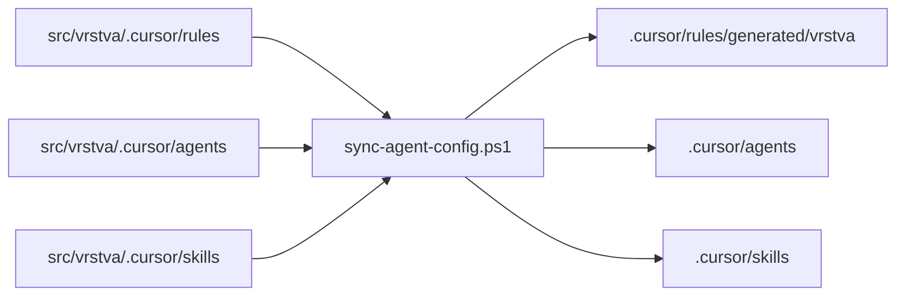

# Codebase Setup

Univerzální, jazyk-agnostická šablona repozitáře pro vývoj řízený AI agenty.

Každá architektonická vrstva v `src/` si nese vlastní guardrails pro agenty
(`.cursor`, `.github`, vnořené `AGENTS.md`), vlastní testy a vlastní dokumentaci.
Společná pravidla jsou v `AGENTS.md` v rootu a v `src/AGENTS.md`.

## Rychlý start

```powershell
# 1. Vygeneruj chybějící/aktualizuj root agentní konfiguraci ze zdrojů ve vrstvách
pwsh -File scripts/sync-agent-config.ps1

# 2. Ověř, že konfigurace není zastaralá (používá CI)
pwsh -File scripts/sync-agent-config.ps1 -Check

# 3. Založ novou vrstvu
pwsh -File scripts/new-layer.ps1 -Name billing

# 4. Spusť testy vrstvy
pwsh -File scripts/test-layer.ps1 -Layer domain
```

## Struktura

```text
AGENTS.md              # globální instrukce pro agenty
src/
  AGENTS.md            # společná pravidla všech vrstev
  domain/              # čistá business logika, žádné I/O
  application/         # orchestrace use-case, přes porty
  infrastructure/      # implementace portů, veškerý vnější přístup
  presentation/        # vstupní bod aplikace, validace a mapování
  shared/              # průřezové primitivy bez závislostí
.cursor/               # aktivní konfigurace pro celý repozitář
.github/workflows/     # CI
scripts/               # nástroje pro správu šablony
docs/                  # projektová dokumentace
```

## Princip: konfigurace vrstvy je zdroj pravdy



Díky tomu funguje konfigurace v obou režimech: když otevřeš celý repozitář
(aktivní je root `.cursor/`) i když otevřeš samotnou vrstvu jako workspace
(aktivní je `.cursor/` uvnitř vrstvy).

## Konvence pro agenty

- Needituj `.cursor/rules/generated/**` — je generováno.
- Po změně `src/<vrstva>/.cursor/` spusť sync.
- Dodrž směr závislostí mezi vrstvami (viz `AGENTS.md`).
