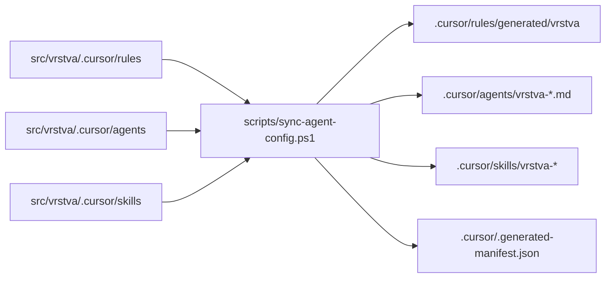
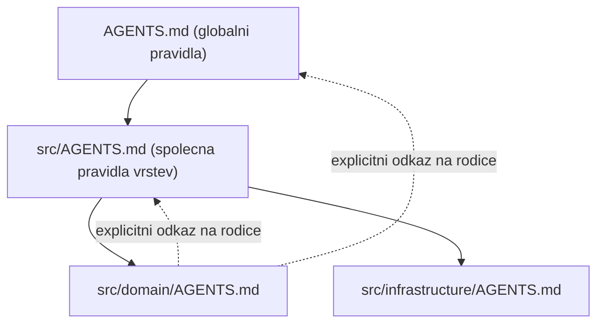

# Agentní konfigurace napříč vrstvami

Tento dokument vysvětluje, proč je repozitář uspořádán takto a jak s konfigurací
pracovat. Je to klíčová část šablony — bez pochopení tohoto mechanismu se
konfigurace vrstev rozejde s root `.cursor/`.

## Princip: vlastnictví vrstvou, aktivace v rootu

Každá vrstva vlastní svou agentní konfiguraci v `src/<vrstva>/.cursor/`. To je
**zdroj pravdy**:

```text
src/<vrstva>/.cursor/
  rules/standards.mdc        # pravidla vrstvy (globs: ["**/*"])
  agents/dev.md              # subagent specializovaný na vrstvu
  skills/workflow/SKILL.md   # pracovní postup vrstvy
```

Cursor má ale dvě omezení, která tvarují celý návrh:

1. Vnořené `.cursor/rules` v podsložkách monorepa se načítají **nespolehlivě**.
   Spolehlivě fungují, jen když je vrstva otevřena jako samostatný workspace.
2. `.github/workflows/` GitHub čte **pouze z rootu** repozitáře.

Proto existuje root `.cursor/`, které je **generovaným zrcadlem** zdrojů ve vrstvách:



Výsledek: konfigurace funguje v **obou režimech**.

| Režim otevření | Aktivní konfigurace |
| --- | --- |
| Celý repozitář | root `.cursor/` (generované zrcadlo, globs `src/<vrstva>/**`) |
| Samotná vrstva | `src/<vrstva>/.cursor/` (globs `**/*`) |

## Mapování a transformace

| Zdroj | Cíl | Transformace |
| --- | --- | --- |
| `rules/*.mdc` | `.cursor/rules/generated/<vrstva>/*.mdc` | `globs` přepsán na `["src/<vrstva>/**"]`, description prefixován `[<vrstva>]`, přidána hlavička GENERATED |
| `agents/*.md` | `.cursor/agents/<vrstva>-*.md` | `name` prefixován názvem vrstvy (pokud už prefix nemá), description prefixován `[<vrstva>]` |
| `skills/<x>/**` | `.cursor/skills/<vrstva>-<x>/**` | `SKILL.md` má prefixovaný `name` a description, ostatní soubory se kopírují |
| — | `.cursor/.generated-manifest.json` | evidence vygenerovaných souborů pro spolehlivý úklid osiřelých souborů |

Zdrojové pravidlo používá `globs: ["**/*"]`, protože v režimu samostatné vrstvy
je workspace kořenem vrstvy. Sync tento glob při generování zúží na `src/<vrstva>/**`,
což je správně pro režim celého repozitáře.

## Pracovní postup

Po každé změně `src/<vrstva>/.cursor/`:

```powershell
pwsh -File scripts/sync-agent-config.ps1
```

Před commitem (a v CI) ověř, že zrcadlo není zastaralé:

```powershell
pwsh -File scripts/sync-agent-config.ps1 -Check
```

Příkaz `-Check` nic nezapisuje a skončí kódem 1, pokud:
- některý generovaný soubor chybí,
- některý generovaný soubor je zastaralý,
- existuje osiřelý generovaný soubor (zdroj byl smazán).

## Hook pro automatický sync

`.cursor/hooks.json` registruje hook `afterFileEdit`, který po editaci souboru
v `src/<vrstva>/.cursor/` spustí sync automaticky. Hook je záměrně **fail-open** —
při jakékoli chybě vrátí úspěch, aby nikdy neblokoval práci. Editace generovaných
souborů v `.cursor/` sync nespouštějí, takže nevzniká smyčka.

## Dědičnost instrukcí

Instrukce se dědí třemi úrovněmi. Cursor vnořené `AGENTS.md` slévá automaticky
(konkrétnější vyhrává), ale každá vrstva na rodiče také explicitně odkazuje —
proto funguje i pro nástroje, které slévání neprovádějí.



## Omezení, která je dobré znát

- **Per-vrstva workflows nejsou spustitelné z rootu.** `src/<vrstva>/.github/workflows/<vrstva>.yml`
  je zdroj pravdy a dokumentace záměru; root `ci.yml` ho nahrazuje dynamickou
  maticí přes vrstvy. Spustitelný je jen při otevření vrstvy jako samostatného repa.
- **Per-vrstva composite actions fungují** (`src/<vrstva>/.github/actions/setup-layer/action.yml`),
  protože lokální akce lze volat cestou.
- **Novou vrstvu není potřeba přidávat do CI ručně** — root `ci.yml` vrstvy objevuje
  dynamicky podle přítomnosti `AGENTS.md`.
- **Hooks jsou pouze root-only** — `hooks.json` se spouští z rootu projektu.
