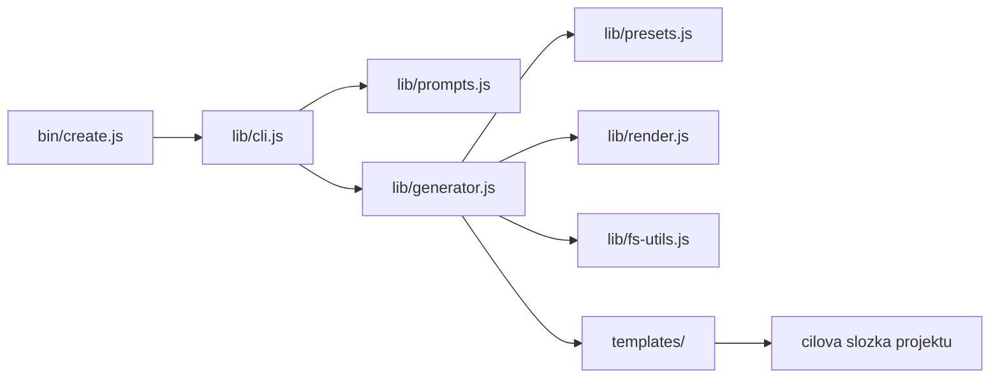

# Jak generátor funguje

## Tok generování



1. `bin/create.js` je tenký wrapper, který zavolá `run()` z `lib/cli.js`.
2. `lib/cli.js` rozparsuje argumenty. Když něco chybí a běží interaktivní
   terminál, doptá se přes `lib/prompts.js`; jinak použije výchozí hodnoty.
3. `lib/presets.js` sestaví model architektury: vrstvy, archetypy, guardrails
   a směr závislostí.
4. `lib/generator.js` vyrenderuje šablony (podmínky + placeholdery) a zapíše je
   přes `lib/fs-utils.js`.
5. `lib/fs-utils.js` je nedestruktivní: existující soubor přeskočí, dokud
   nezadáš `--force`.

## Nedestruktivní zápis

`createWriter` v `lib/fs-utils.js` rozhoduje o každém souboru:

| Stav | Bez `--force` | S `--force` |
| --- | --- | --- |
| Soubor neexistuje | `create` | `create` |
| Soubor existuje | `skip` | `overwrite` |

`--dry-run` nic nezapisuje a ani nevytváří složky, jen vypíše plán.

## Konfigurace projektu

Generátor zapíše do kořene projektu `.scaffold.json`:

```json
{
  "generator": "create-codebase-scaffold",
  "version": "0.1.0",
  "projectName": "my-app",
  "architecture": "clean",
  "layers": ["Domain", "Application", "Infrastructure", "Presentation", "Shared"],
  "tooling": "pwsh",
  "machinery": "full",
  "agents": ["cursor", "codex"],
  "ci": true
}
```

Skripty projektu ho čtou, aby věděly, jak širokou kontrolu mají dělat
(`machinery`) a jaké příkazy mají vypisovat.

## Vrstvy a názvy

- Název vrstvy je vždy **PascalCase** (`Domain`, `AntiFraud`) a odpovídá složce
  `src/<Layer>/`.
- Název artefaktů používá **kebab-case slug** odvozený z názvu
  (`AntiFraud` -> `anti-fraud`). Používá se v `.cursor/agents/<slug>-dev.md`,
  `.cursor/skills/<slug>-workflow/` a v názvu CI jobu.
- Volný seznam vrstev se normalizuje: `anti-fraud`, `anti_fraud` i `antiFraud`
  vedou na `AntiFraud`.

## Archetypy vrstev

Archetyp určuje odpovědnost a guardrails vrstvy. Presety mapují názvy vrstev na
archetypy; volný seznam je odhaduje podle slugu názvu. Neznámý název dostane
obecný archetyp s markery `DOPLŇ:`, které musí uživatel doplnit — a dokud tam
jsou, `verify-layer` vrstvu odmítne.

Zabudované archetypy: `domain`, `application`, `infrastructure`, `presentation`,
`shared`, `adapters`, `business`, `data`, `features` a `default`.

Jejich odpovědnosti, guardrails a směr závislostí vyjmenovává
[`layers.md`](layers.md).
