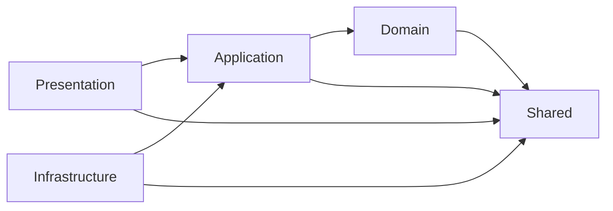

# Vrstvy repozitáře

Repozitář používá vrstvenou architekturu se závislostmi směřujícími dovnitř.
Každá vrstva je samostatná složka v `src/` s vlastními guardrails, testy a dokumentací.

## Přehled

| Vrstva | Odpovědnost | Smí záviset na |
| --- | --- | --- |
| [`domain`](../src/domain/) | Čistá business logika a invarianty. Bez I/O. | `shared` |
| [`application`](../src/application/) | Orchestrace use-case, definice portů. | `domain`, `shared` |
| [`infrastructure`](../src/infrastructure/) | Implementace portů, veškerý vnější přístup. | `application`, `domain`, `shared` |
| [`presentation`](../src/presentation/) | Vstupní bod, validace a mapování. | `application`, `shared` |
| [`shared`](../src/shared/) | Průřezové primitivy bez závislostí. | nic |

## Směr závislostí



Zakázané je zejména `domain` -> `infrastructure`, `application` -> `infrastructure`
a jakákoli závislost na `presentation`.

## Anatomie vrstvy

Každá vrstva má shodnou strukturu:

```text
src/<vrstva>/
  AGENTS.md        # guardrails vrstvy + odkazy na rodičovské instrukce
  README.md        # účel vrstvy, jak ji spustit a testovat
  .cursor/         # ZDROJ PRAVDY agentní konfigurace vrstvy
  .github/         # composite action a definice pipeline vrstvy
  src/             # produkční kód vrstvy
  tests/           # unit/ a integration/
  docs/            # README.md a decisions/ (ADR)
```

Strukturu vynucuje `scripts/verify-layer.ps1`, který běží v CI pro každou vrstvu.

## Založení nové vrstvy

```powershell
pwsh -File scripts/new-layer.ps1 -Name <vrstva>
```

Generátor vytvoří celou anatomii. Pro známé vrstvy (`domain`, `application`,
`infrastructure`, `presentation`, `shared`) vloží konkrétní guardrails; pro novou
vrstvu vloží obecnou sadu s markery `DOPLŇ:`, které je nutné nahradit.

Dokud jsou v `AGENTS.md` markery `DOPLŇ:` nebo tokeny `__TOKEN__`, vrstva
neprojde kontrolou `scripts/verify-layer.ps1` a CI selže. To je záměr — guardrails
mají být konkrétní, ne obecné fráze.

Poté spusť:

```powershell
pwsh -File scripts/sync-agent-config.ps1
pwsh -File scripts/verify-layer.ps1 -Layer <vrstva>
pwsh -File scripts/test-layer.ps1 -Layer <vrstva>
```
