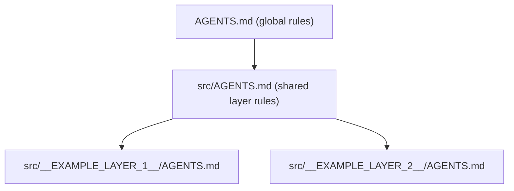

# Agent configuration across layers

Each layer owns its agent configuration in `src/<Layer>/.cursor/`. That is the
**source of truth**:

```text
src/<Layer>/.cursor/
  rules/standards.mdc        # layer rules
  agents/dev.md              # subagent specialized for the layer
  skills/workflow/SKILL.md   # layer workflow
```

The root `.cursor/` is a **generated mirror** of these sources. Thanks to that,
the configuration works in two modes:

| Opening mode | Active configuration |
| --- | --- |
| Whole repository | root `.cursor/` (generated mirror, globs `src/<Layer>/**`) |
| The layer alone | `src/<Layer>/.cursor/` (globs `**/*`) |

## Mapping and transformation

| Source | Target |
| --- | --- |
| `rules/*.mdc` | `.cursor/rules/generated/<slug>/*.mdc` (globs narrowed to `src/<Layer>/**`) |
| `agents/*.md` | `.cursor/agents/<slug>-*.md` |
| `skills/<x>/**` | `.cursor/skills/<slug>-<x>/**` |
| — | `.cursor/.generated-manifest.json` (record of generated files) |

## Workflow

After every change to `src/<Layer>/.cursor/`:

```text
__SYNC_CMD__
```

Before committing (and in CI), verify that the mirror is not stale:

```text
__SYNC_CHECK_CMD__
```

The `--check` command writes nothing and fails if any generated file is missing,
stale, or left orphaned after a removed source.

## What sync never changes

- `src/<Layer>/.cursor/**` is the source of truth — sync never writes into it.
- It writes only into the root `.cursor/`, and only for files tracked in the manifest.
- The root `.cursor/` is regenerated even if someone edited it by hand; manual
  changes there have a short life.

## Instruction inheritance

Instructions are inherited through three levels. Each layer explicitly links to
its parents, so it works even for tools that do not merge nested instructions.


