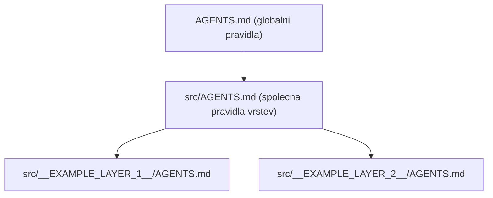

# Agentní konfigurace napříč vrstvami

Každá vrstva vlastní svou agentní konfiguraci v `src/<Layer>/.cursor/`. To je
**zdroj pravdy**:

```text
src/<Layer>/.cursor/
  rules/standards.mdc        # pravidla vrstvy
  agents/dev.md              # subagent specializovaný na vrstvu
  skills/workflow/SKILL.md   # pracovní postup vrstvy
```

Root `.cursor/` je **generovaným zrcadlem** těchto zdrojů. Díky tomu funguje
konfigurace ve dvou režimech:

| Režim otevření | Aktivní konfigurace |
| --- | --- |
| Celý repozitář | root `.cursor/` (generované zrcadlo, globs `src/<Layer>/**`) |
| Samotná vrstva | `src/<Layer>/.cursor/` (globs `**/*`) |

## Mapování a transformace

| Zdroj | Cíl |
| --- | --- |
| `rules/*.mdc` | `.cursor/rules/generated/<slug>/*.mdc` (globs zúžen na `src/<Layer>/**`) |
| `agents/*.md` | `.cursor/agents/<slug>-*.md` |
| `skills/<x>/**` | `.cursor/skills/<slug>-<x>/**` |
| — | `.cursor/.generated-manifest.json` (evidence vygenerovaných souborů) |

## Pracovní postup

Po každé změně `src/<Layer>/.cursor/`:

```text
__SYNC_CMD__
```

Před commitem (a v CI) ověř, že zrcadlo není zastaralé:

```text
__SYNC_CHECK_CMD__
```

Příkaz `--check` nic nezapisuje a skončí chybou, pokud některý generovaný soubor
chybí, je zastaralý, nebo zůstal osiřelý po smazaném zdroji.

## Co sync nikdy nemění

- `src/<Layer>/.cursor/**` je zdroj pravdy — sync do něj nikdy nezapisuje.
- Zapisuje se pouze do root `.cursor/` a jen u souborů vedených v manifestu.
- Root `.cursor/` se regeneruje i tehdy, kdyby ho někdo upravil ručně; ruční
  změny zde mají krátký život.

## Dědičnost instrukcí

Instrukce se dědí třemi úrovněmi. Každá vrstva na rodiče explicitně odkazuje,
takže funguje i pro nástroje, které vnořené instrukce neslévají.


